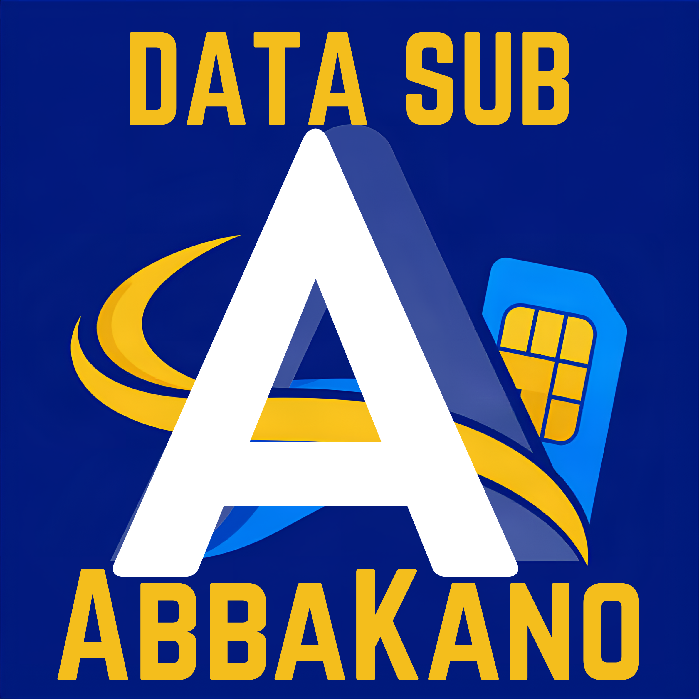

# AbbaKano Admin Console

<p align="center">
  
</p>

<h3 align="center">Institutional Telecommunications, VTU Liquidity & Reseller Operations Portal</h3>

<p align="center">
  <strong>High-Velocity Telecom Dispatch & Virtual Account Settlement Console for Enterprise VTU Aggregators in Nigeria.</strong>
</p>

<p align="center">
  
  
  
  
  
</p>

---

## 📖 Overview

**AbbaKano Admin Console** is a mission-critical administrative web platform engineered for institutional telecommunications providers and VTU resellers. It provides complete operational visibility, upstream supplier liquidity monitoring, automated multi-carrier routing (MTN, Airtel, Glo, 9mobile), and real-time bank virtual account reconciliation (Moniepoint, Wema Bank).

Designed with a strict **executive minimalist UI/UX philosophy**, the interface removes clutter and unnecessary techno-jargon, presenting non-technical operators and financial officers with clean data, instant controls, and rock-solid reliability.

---

## ✨ Key Capabilities

- **⚡ Executive KPI Dashboard**: Real-time gross transaction volumes, net margins, liquidity vault sums, and network dispatch share breakdown.
- **🔄 Multi-Carrier VTU Routing**: Instant route failover toggles across MTN, Airtel, Glo, and 9mobile pipelines with latency and success rate monitors.
- **🏦 Dedicated Virtual Account (DVA) Ledger**: Automated ingestion and matching for Moniepoint and Wema Bank inflows, with telephone-based resolution for unmatched deposits.
- **📊 Master Transaction Ledger**: Full audit trails for SME data bundles, airtime topups, and utilities with search by MSISDN, carrier filtering, and receipt printing.
- **💰 Upstream Provider Balances**: Real-time liquidity tracking with low-stock warnings, runway calculation, and one-click bank refill instruction generation.
- **👥 Reseller Management**: Searchable directory of registered reseller wallets, balance inquiries, and instant account block/unblock controls.
- **🛡️ Super Administrator Security**: Single-persona executive authentication, sanitized error masking, and immutable activity audit logging.
- **📱 Fully Mobile Responsive**: Engineered with a responsive slide-out drawer, mobile search modal, and horizontal-scrolling ledger tables.

---

## 🛠️ Technology Stack

| Layer | Technology |
|---|---|
| **Framework** | [Next.js 16](https://nextjs.org/) (App Router, Turbopack) |
| **Language** | [TypeScript](https://www.typescriptlang.org/) (Strict mode, zero `any` leaks) |
| **Styling** | [Tailwind CSS v4](https://tailwindcss.com/) + Custom CSS Design System |
| **Icons & Typography** | Google Fonts ([Plus Jakarta Sans](https://fonts.google.com/specimen/Plus+Jakarta+Sans), [JetBrains Mono](https://fonts.google.com/specimen/JetBrains+Mono), [Material Symbols](https://fonts.google.com/icons)) |
| **State & Context** | React Context API (`SidebarContext`) + Client-side state |
| **Data Service Layer** | Dual-mode TypeScript API layer (`services/api.ts`) supporting live REST endpoints with mock fallback |

---

## 📂 Project Architecture

```
abbakano_admin_panel/
├── app/
│   ├── app/
│   │   ├── (dashboard)/            # Authenticated admin routes
│   │   │   ├── overview/           # Executive KPI dashboard
│   │   │   ├── users/              # Reseller accounts & wallet management
│   │   │   ├── deposits/           # Inflows & bank DVA settlement
│   │   │   ├── transactions/       # Master dispatch ledger
│   │   │   ├── vtu-services/       # Carrier failover & routing controls
│   │   │   ├── provider-balances/  # Upstream vault liquidity & refills
│   │   │   ├── support/            # Customer inquiries & wallet credits
│   │   │   ├── notifications/      # Real-time alert feed
│   │   │   ├── audit-logs/         # Security activity trail
│   │   │   └── settings/           # Wholesale margins & app maintenance
│   │   ├── login/                  # Superadmin login portal
│   │   ├── layout.tsx              # Root HTML & body with hydration guards
│   │   ├── page.tsx                # Institutional landing page
│   │   └── globals.css             # Tailwind v4 theme tokens
│   ├── components/
│   │   ├── layout/                 # TopNav, Sidebar, PageHeader
│   │   └── ui/                     # Toggle switches, Badges, Modals
│   ├── context/                    # Sidebar mobile context
│   ├── mock/                       # Realistic Nigerian telecom data fixtures
│   ├── services/                   # Centralized API service & error sanitization
│   ├── types/                      # TypeScript domain models (telecom.ts)
│   ├── BACKEND_INTEGRATION_GUIDE.md# Exhaustive backend API specification
│   ├── package.json
│   └── tsconfig.json
```

---

## 🚀 Getting Started

### Prerequisites
- [Node.js](https://nodejs.org/) v18.18 or higher (v20+ recommended)
- `npm` (v9+) or `yarn` / `pnpm`

### Installation

1. **Clone the repository:**
   ```bash
   git clone https://github.com/Spectre-Techie/AbbaKano-Admin-Panel.git
   cd AbbaKano-Admin-Panel
   ```

2. **Install dependencies:**
   ```bash
   npm install
   ```

3. **Start the local development server:**
   ```bash
   npm run dev
   ```

4. Open your browser and navigate to:
   ```
   http://localhost:3000
   ```

### Default Superadmin Credentials (Demo Mode)
- **Email:** `admin@abbakano.ng`
- **Password:** `Admin@AbbaKano2026!`

---

## 🔌 Backend Integration

This frontend is architected for zero-friction integration with your backend API.

- Full endpoint specifications, JSON request/response payloads, and security requirements are documented in detail in:  
  👉 **[`BACKEND_INTEGRATION_GUIDE.md`](./BACKEND_INTEGRATION_GUIDE.md)**

To connect to your live backend:
1. Create a `.env.local` file in the project root:
   ```env
   NEXT_PUBLIC_API_BASE_URL=https://api.abbakano.ng/api/v1
   NEXT_PUBLIC_USE_MOCK=false
   ```
2. The service layer [`services/api.ts`](./services/api.ts) will automatically route all requests to your live endpoints with Bearer JWT tokens.

---

## 🔒 Security Practices

- **Role Isolation**: Only Super Administrator credentials can access the administration portal.
- **Zero Client-Side Secret Leakage**: No passwords or private tokens are persisted in unencrypted client storage.
- **Error Masking**: Database queries and system stack traces are sanitized before presentation to operators.
- **Input Sanitization**: Monetary inputs enforce strictly positive figures with a ₦500,000 single transaction ceiling.
- **XSS Protection**: Zero use of `dangerouslySetInnerHTML`. All dynamic text renders through React DOM nodes.

---

## 📄 License & Attribution

Copyright © 2026 **AbbaKano Telecom Services Ltd.** All rights reserved.  
Maintained by [Spectre-Techie](https://github.com/Spectre-Techie).
